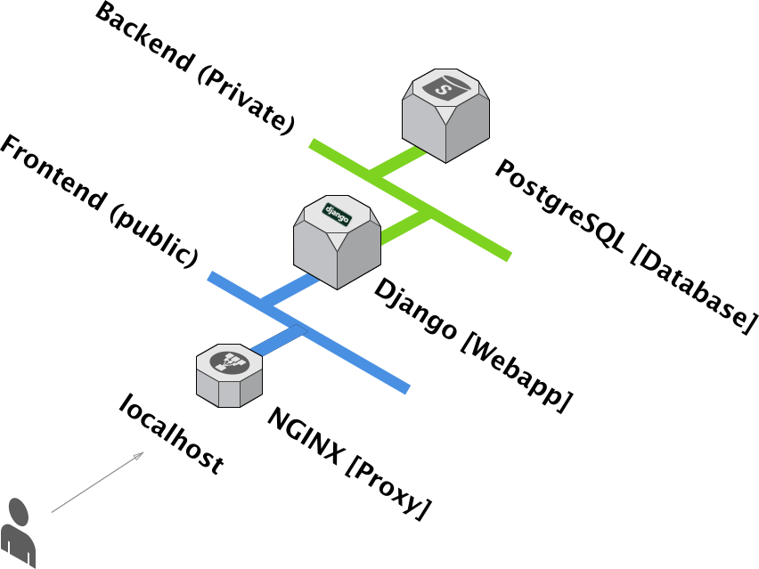
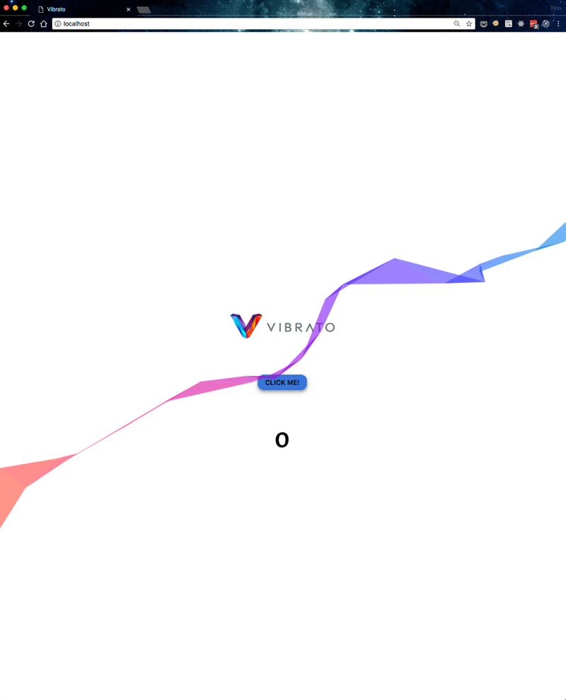
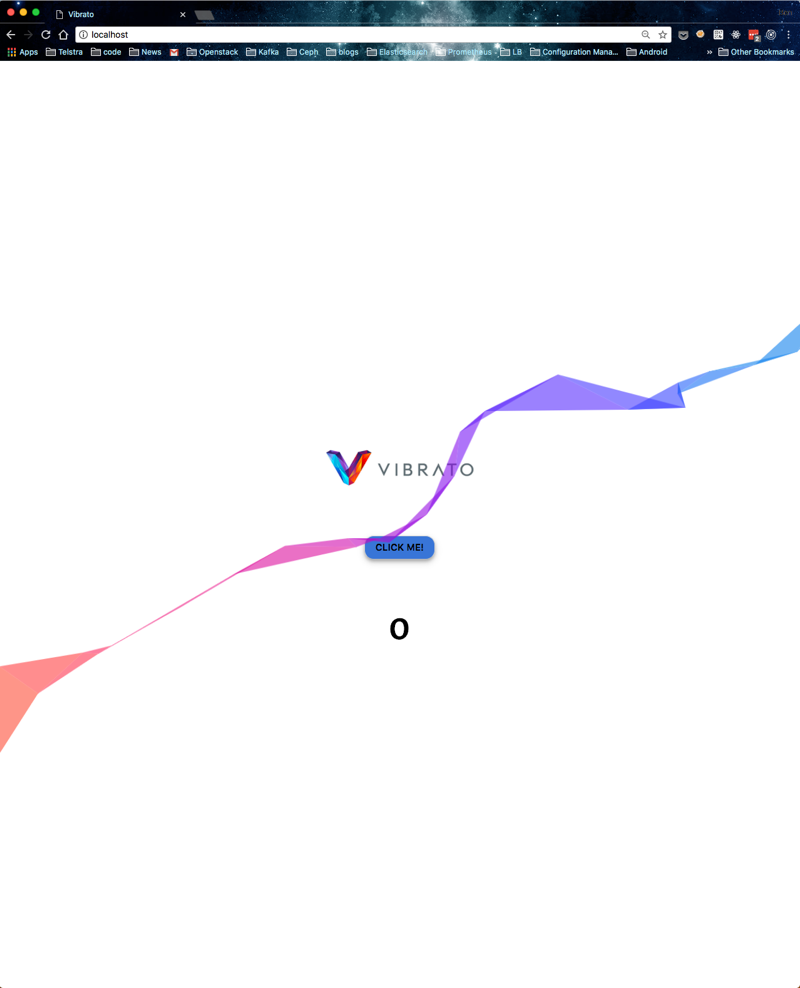

# N-Tier Stack Example
This repository represents a collection of docker files and
the required source code for the deployment and hosting of 
a basic web app which is integrated with a proxy (NGINX) and 
a backend database, in this case PostgreSQL.

## Architecture

The overall architecture that is contained within the docker
deployment can be seen below

<p align="center">

</p>


## Components
The stack is comprised of the following components, which 
have been chosen for their familiarity and easy/quick stand
up time.

### NGINX
Acts as a reverse proxy, this is the only "publicly" facing
container.

### Django
This is hosting a basic web-app which is serving
a HTML template which is rendering data fetched
from the database container

### PostgreSQL
basic postgres container which is contains data that
is read/written from the Django application.


# Landing Page
The basic application/landing page presents a button 
which is clickable. On each click it will make a 
POST request to the webapp, the webapp will then increment
the currently stored value in the database.
On each click a nice animation is drawn on the canvas.


# Getting started
The instructions for getting the stack up and running 
can be found below. Some things to consider for a successful
replication of this stack in a new environment are summarised
as well. 
## Environment
The stack was developed and tested in the following environment
* macOS High Sierra, version 10.13.3
* docker-compose version 1.18.0, build 8dd22a9
* docker version 17.12.0-ce, build c97c6d6


## Clone
First steps will be to pull this repo and change into the repositories
root directory with the following commands:
```bash
git clone https://github.com/castlemilk/demo1.git
cd demo1
```

## Build the stack [OPTIONAL]
This will carry out the steps to freshly build all of the 
docker images used/developed for this stack. Alternatively,
if this step is skipped, then we'll be using docker images
hosted on [docker hub](<insert-hub-link>)
```bash
docker-compose build
```
## Start the stack
This will execute the available docker-compose.yml file, carrying 
out all the steps to create our multi-tiered architecture,
and initialising all the containers with their required data
and configuration.
```bash
docker-compose pull
docker-compose up --no-build -d
```

##  Run on different port
If your local environment does'nt support running on lower port ranges
then we can get the stack to run on a different higher port. This can be achieved by setting the docker-compose.yml file as follows:
```yaml
services:
  ...
  proxy:
    ...
    ports:
      - <insert-higher-port-here>:80
    
  ...
```

## check/validate the stack
Once the stack is up and running (hopefully without issues), we can
check the status of the stack via:
```bash
docker ps | grep demo
```
Or
```bash
docker-compose top
```

## view the output of the stack
Assuming there's no issues binding to port 80 on localhost, it 
should be possible to browse to:

[localhost](http://localhost)


# Example of UI

## Initially
<p align="center">

</p>

## After a few clicks
<p align="center">

</p>


